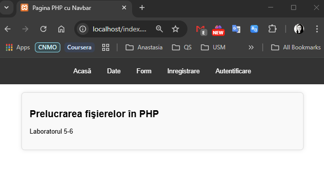
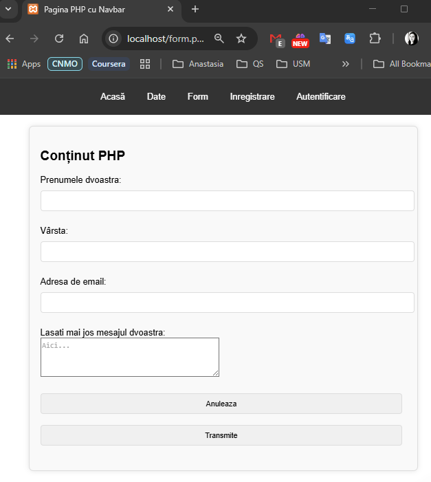

# containers05

## Scopul lucrării

Gestionarea interacțiunii între mai multe containere.

## Sarcina

Creez o aplicație PHP pe baza a două containere: nginx, php-fpm

## Pregătire

Ma asigur ca am instalat pe computer Docker.

## Efectuarea lucrării

### Descrierea lucrului cu Git-ul

1. M-am conectat la contul meu de GitHub.
2. Am dat click pe "New repository".
3. Am denumit repository-ul, am bifat să fie inițializat cu un fișier nou `README.md` și l-am creat.
4. Am clonat repository-ul în Visual Studio (VS) Code:
   - `git clone https://github.com/anastasiaCazacu/containers05.git` - clonez repository-ul.
   - `cd containers05` - accesez folderul clonat.
   - `git checkout -B lab05` - creez branchiul si ma mut pe el si modific fisierul meu README.MD si ulterior doar adaug continutul.
   - `git add *` - adaug tot continutul.
   - `git status` - verific statutul si ma asigur ca am modificarile dorite.
   - `git commit -m "structure defined"` - creez commitul
   - `git push origin lab05` - push commit în depozitul de la distanță
   - `git checkout main`- Comut pe branch-ul principal
   - `git merge lab05`- Integrez (merge) branch-ul nou în main.
   - `git push origin main` - Împing schimbările pe GitHub.

### Descrierea efectuarii lucrarii

1. Creez directorul și copierez site-ului PHP:
   In directorul nou creat creez unca un director `mounts/site` cu `mkdir -p mounts/site`.

2. Copiez fișierele site-ului PHP create în cursul de Programare PHP în directorul creat mai sus.

3. Creez fișierul .gitignore în rădăcina proiectului și adăug următoarele linii:

   ```
   # Ignore files and directories
   mounts/site/*
   ```

4. Creez în directorul containers05 fișierul nginx/default.conf cu conținutul propus

5. Crez fisiaerul `docker-compose.yml` cu continutul propus in laborator:

   ```
       <!-- version: '3.8' -->
       networks:
           internal:
               driver: bridge

       services:
           backend:
               image: php:7.4-fpm
               container_name: backend
               volumes:
               - ./mounts/site:/var/www/html
               networks:
               - internal
       frontend:
           image: nginx:1.23-alpine
           container_name: frontend
           ports:
           - "80:80"
           volumes:
           - ./mounts/site:/var/www/html
           - ./nginx/default.conf:/etc/nginx/conf.d/default.conf
           networks:
           - internal
   ```

## Pornirea aplicatiei și testarea

1. Creez reteaua si pornesc containerul:
   `docker-compose up -d`

2. Perfect! Containerul meu ruleaza. Verific functionalitatea:
   `http://localhost`
   Site-ul ruleaza cum ma asteptam. Toate paginile sunt functionale. Site-ul a fost testat cu succes la `http://localhost`., .

## Răspunsuri la întrebări

1. **În ce mod în acest exemplu containerele pot interacționa unul cu celălalt?**  
   Prin rețeaua Docker definită ca `internal`, care permite containerelor să comunice folosind numele de servicii (`backend` și `frontend`).

2. **Cum văd containerele unul pe celălalt în cadrul rețelei internal?**  
   Se pot accesa după `numele de serviciu` specificat în `docker-compose.yml`. De exemplu, `frontend` accesează `backend` prin `fastcgi_pass backend:9000`.

3. **De ce a fost necesar să se suprascrie configurarea nginx?**  
   Configurația implicită Nginx nu știe cum să proceseze fișiere PHP. Prin suprascrierea cu `default.conf`, am specificat cum să trimită cererile PHP către `php-fpm`.

## Concluzii

Această lucrare a demonstrat importanța separării serviciilor într-un mediu Dockerizat și cum poate fi realizată interacțiunea între containere printr-o rețea personalizată.
